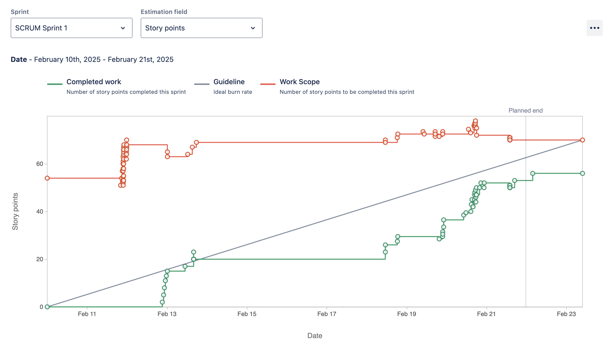

# Phone to Table - CS3398 Project

## Table of Contents
* [Team](#team)
* [Vision](#vision)
* [Features](#features)
* [Technologies](#technologies)
* [Features](#features)
* [Contributions](#constributions)
* [Reports](#reports)

## Team
- Who are our teammates?
    - Cameron Archuleta
    - Tushig Battulga
    - Denise Boler
    - Amanda Orozco
    - Stephen Smyth
    - Elliot Sonoqui

## Vision
### What are we creating?
    A web application that helps users generate recipes based on available ingredients, online content, and personal preferences. We want to bring convenience and fun to the kitchen.
### Who are we creating this for? 
    The target audience are people looking for recipes that is built around their interests, current stock of ingredients, and nutritional profile. Our audience will find value in this app as it will create an ease of use interface that will create a convenient recipe that hits all of their goals.
### Why are we doing this project?
    This web page will help users reduce food waste by making the most of the ingredients they already have. It will also save them money by suggesting recipes that eliminate the need for unnecessary grocery trips. Additionally, it will simplify meal planning by providing tailored recipe recommendations based on their scanned pantry items.

## Technologies
### Front-End:
    - REACT 
    - HTML 
    - CSS 
    - JavaScript
### Back-End:
    - MongoDB
    - JavaScript
    - APIs: Instagram, Spoonacular, OpenAI

## Features
**Feature 1: User input to recipe generatoin**
- Description: user inputs their pantry items and we provide recipes using their items
- User Stories:
    - As a homecook, I want to be able to provide a list of my pantry items so that I can have personalized recipes with what I currently have at home

**Feature 2: URL input to recipe macro generation**
- Description: user provides a URl and we provide the recipes' macros  
 - User Stories:
    - As an health-consciencous user, I want to be able to know the macros of recipes to make macro tracking easier

## Contributitions
### Sprint 1

>**Cameron Archuleta** *""I researched the different tools that we will be using for this project. Created a wireframe using figma
                        to give an idea of what our website will look like and created a navbar that links our home & pantry page.""*
- [SCRUM-90](https://cs3398-luna-spring.atlassian.net/browse/SCRUM-90) Research: React & HTML
    - [Bitbucket](https://bitbucket.org/cs3398-luna-s25/recipe_generator/branch/SCRUM-90-research-react-html)
- [Scrum-91](https://cs3398-luna-spring.atlassian.net/browse/SCRUM-91) Create a Mock Design of Starter Page
    - [Bitbucket](https://bitbucket.org/cs3398-luna-s25/recipe_generator/branch/SCRUM-91-create-a-mock-design-of-starter)
- [Scrum-72](https://cs3398-luna-spring.atlassian.net/browse/SCRUM-72) Create Navigation Bar
    - [Bitbucket](https://bitbucket.org/cs3398-luna-s25/recipe_generator/commits/a0e193d713be17baa3a67890ac6f411aacda1c0d)
- [Scrum-73](https://cs3398-luna-spring.atlassian.net/browse/SCRUM-73) Implement Icon & Pantry Button
    - [Bitbucket](https://bitbucket.org/cs3398-luna-s25/recipe_generator/commits/a0e193d713be17baa3a67890ac6f411aacda1c0d)

<<<<<<< HEAD
- Tushig Battulga: "Led a meeting to finalize the UI and delegate tasks, set up the development environment, researched React state management, UI frameworks, and routing, and built a backend demo integrating OpenAI’s API for recipe generation."  
    - Jira Task: Agree upon starter page and delegate work to team members  
        - [(SCRUM-92)](https://cs3398-luna-spring.atlassian.net/browse/SCRUM-92) | [Bitbucket](https://bitbucket.org/cs3398-luna-s25/{45b01286-1397-4155-a753-0c05200a2659}/branch/SCRUM-92-agree-upon-starter-page-and-delegate-work-to-team-members) 
    - Jira Task: React Project Tools for Setup  
        - [(SCRUM-87)](https://cs3398-luna-spring.atlassian.net/browse/SCRUM-87) | [Bitbucket](https://bitbucket.org/cs3398-luna-s25/{45b01286-1397-4155-a753-0c05200a2659}/branch/SCRUM-87-research-react-project-tools-for-setup)  
    - Jira Task: Research React State Management  
        - [(SCRUM-84)](https://cs3398-luna-spring.atlassian.net/browse/SCRUM-84) | [Bitbucket](https://bitbucket.org/cs3398-luna-s25/{45b01286-1397-4155-a753-0c05200a2659}/branch/SCRUM-84-research-react-state-management)  
    - Jira Task: Research UI Frameworks and Components  
        - [(SCRUM-88)](https://cs3398-luna-spring.atlassian.net/browse/SCRUM-88) | [Bitbucket](https://bitbucket.org/cs3398-luna-s25/{45b01286-1397-4155-a753-0c05200a2659}/branch/SCRUM-88-research-ui-frameworks-and-components)  
    - Jira Task: Research Routing for Navigation Between Pages  
        - [(SCRUM-89)](https://cs3398-luna-spring.atlassian.net/browse/SCRUM-89) | [Bitbucket](https://bitbucket.org/cs3398-luna-s25/{45b01286-1397-4155-a753-0c05200a2659}/branch/SCRUM-89-research-routing-for-navigation)  
    - Jira Task: OpenAI API Integration with Sample JSON Ingredients File  
        - [(SCRUM-86)](https://cs3398-luna-spring.atlassian.net/browse/SCRUM-86) | [Bitbucket](https://bitbucket.org/cs3398-luna-s25/{45b01286-1397-4155-a753-0c05200a2659}/branch/SCRUM-86-open-ai-api-integration-with-sample-json-ingredients-file)  

- Denise Boler: "<sentence_on_what_you_did_this_sprint>"
    - Jira Task: <Jira_Task_Name>
    - Commit History: <Bitbucket_commits>
- Amanda Orozco: "Provided research materials, documentation, and tutorial resources for both frontend and backend development, with a focus on integrating MongoDB, optimizing backend features, and enhancing SupaBase and Flask functionality."
    - **Jira Task: Backend Features and Design**
        - **[(SCRUM-64)](https://cs3398-luna-spring.atlassian.net/browse/SCRUM-64)**  
        - **[Bitbucket](https://bitbucket.org/cs3398-luna-s25/%7B45b01286-1397-4155-a753-0c05200a2659%7D/branch/SCRUM-64-backend-features-and-design)**
    - **Jira Task: SupaBase/Flask Features**
        - **[(SCRUM-63)](https://cs3398-luna-spring.atlassian.net/browse/SCRUM-63)**  
        - **[Bitbucket](https://bitbucket.org/cs3398-luna-s25/%7B45b01286-1397-4155-a753-0c05200a2659%7D/branch/SCRUM-63-research-supabase-flask-designs)**
    - **Jira Task: Research React**
        - **[(SCRUM-50)](https://cs3398-luna-spring.atlassian.net/browse/SCRUM-50)**  
        - **[Bitbucket](https://bitbucket.org/cs3398-luna-s25/%7B45b01286-1397-4155-a753-0c05200a2659%7D/branch/SCRUM-50-research-react)**
    - **Jira Task: Download Apps/Logins**
        - **[(SCRUM-54)](https://cs3398-luna-spring.atlassian.net/jira/software/projects/SCRUM/boards/1/timeline?selectedIssue=SCRUM-54)**  
        - **[Bitbucket](https://bitbucket.org/cs3398-luna-s25/recipe_generator/commits/branch/SCRUM-54-download-apps-logins)**
    - **Jira Task: Backend Database Startup** 
        - **[(SCRUM-94)](https://cs3398-luna-spring.atlassian.net/browse/SCRUM-94)** 
        - **[Bitbucket](https://bitbucket.org/cs3398-luna-s25/%7B45b01286-1397-4155-a753-0c05200a2659%7D/branch/SCRUM-94-backend-database-startup)**

- Stephen Smyth: "For Sprint 1, I researched how we could organize the code, helped set up dev environments, and coded a basic backend server"
    - Jira Task: [Research how to organize a large project](https://cs3398-luna-spring.atlassian.net/browse/SCRUM-65?atlOrigin=eyJpIjoiMDJiY2U2OTQzMTcyNDU2YWI2NjE2MDc3Mjc5NDNhYWQiLCJwIjoiaiJ9) -- [bitbucket](https://bitbucket.org/cs3398-luna-s25/%7B45b01286-1397-4155-a753-0c05200a2659%7D/branch/SCRUM-65-research-how-to-organize-a-larg)
    - Jira Task: [Make scaffolding for frontend and backend](https://cs3398-luna-spring.atlassian.net/browse/SCRUM-66?atlOrigin=eyJpIjoiYzQzYTIzOGE5MmI1NDkwOWFiM2IyYmZlZDQ5ZGRmZjEiLCJwIjoiaiJ9) -- [bitbucket](https://bitbucket.org/cs3398-luna-s25/%7B45b01286-1397-4155-a753-0c05200a2659%7D/branch/SCRUM-66-make-scaffolding-for-frontend-a)
    - Jira Task: [Make basic backend server](https://cs3398-luna-spring.atlassian.net/browse/SCRUM-95?atlOrigin=eyJpIjoiMmQwYzk4MDA4YTBiNGRkYmI3YWNlZWQxNjYxNDZkNTQiLCJwIjoiaiJ9) -- [bitbucket](https://bitbucket.org/cs3398-luna-s25/%7B45b01286-1397-4155-a753-0c05200a2659%7D/branch/SCRUM-95-make-basic-backend-server)

- Elliot Sonoqui: "I did research about the different components we are using, created UI mockups for our application, and created the homepage using react router and useNavigate to jump from page to page."
    - Jira Task: **[Research REACT/Supabase/Flask/OpenAI(SCRUM53)](https://cs3398-luna-spring.atlassian.net/browse/SCRUM-53)**
    - Commit History: **[(bitbucket)](https://bitbucket.org/cs3398-luna-s25/%7B45b01286-1397-4155-a753-0c05200a2659%7D/branch/feature/SCRUM-53-research-react-supabase/flask/o)**
    
    - Jira Task: **[Download Apps/Logins(SCRUM54)](https://cs3398-luna-spring.atlassian.net/browse/SCRUM-54)**
    - Commit History: **[(bitbucket)](https://bitbucket.org/cs3398-luna-s25/recipe_generator/branch/SCRUM-54-download-apps-logins)**

    - Jira Task: **[upload zoom video and transcript explaining code(SCRUM93)](https://cs3398-luna-spring.atlassian.net/browse/SCRUM-93)**
    - Commit History: **[(bitbucket)](https://bitbucket.org/cs3398-luna-s25/recipe_generator/branch/SCRUM-93-upload-zoom-video-and-transcrip)**

    - Jira Task: **[add hex color scheme(SCRUM58)](https://cs3398-luna-spring.atlassian.net/browse/SCRUM-58)**
    - Commit History: **[(bitbucket)](https://bitbucket.org/cs3398-luna-s25/recipe_generator/branch/SCRUM-58-add-hex-color-scheme)**

    - Jira Task: **[Work on UI for the app(SCRUM61)](https://cs3398-luna-spring.atlassian.net/browse/SCRUM-61)**
    - Commit History: **[(bitbucket)](https://bitbucket.org/cs3398-luna-s25/recipe_generator/branch/SCRUM-61-work-on-ui-for-the-app)**

    - Jira Task: **[create a home page(SCRUM59)](https://cs3398-luna-spring.atlassian.net/browse/SCRUM-59)**
    - Commit History: **[(bitbucket)](https://bitbucket.org/cs3398-luna-s25/recipe_generator/branch/SCRUM-61-work-on-ui-for-the-app)**

Report:

* *Completed graph should be a little higher at the end as Dr. Lehr allowed a team member (Tushig) to submit his backend demo as a part of Sprint 1 but it isn't reflected here in the graph period.

Next Steps:
- Cameron Archuleta
    - this
    - that
- Tushig Battulga
    - implement a database with MongoDB that stores the ingredients and their quantities in the pantry
    - make the pantry database editable in regards to entries and quantity
    - connect the frontend with the backend
- Denise Boler
    - this
    - that
- Amanda Orozco
    - Develop the database with MongoDB and have it interact with the JSON file
    - Writing unit test cases for backend
- Stephen Smyth
    - Make structures for routes, controllers, and services in backend
    - Set up CICD pipeline and deployment
- Elliot Sonoqui
    - Create a Form for ingredient input
    - Create a recipe search 
    - Create a JSON file
=======
>**Tushig Battulga** *"Organized meeting to come to a consensus on the UI and delegate teams and tasks for the backend + frontend. Setup my environment for our project (JavaScript, React, Node, etc.) Researched, learned, and compiled notes for React state management. Created demo for backend, that takes in a sample JSON file with ingredients and uses the ingredients as a prompt to OpenAI's API to generate a recipe. Researched, learned, and compiled notes for routing navigation."*
- [SCRUM-92](https://cs3398-luna-spring.atlassian.net/browse/SCRUM-92) Agree upon starter page and delegate work to team
    - bitbucket link
- [SCRUM-87](https://cs3398-luna-spring.atlassian.net/browse/SCRUM-87) React poject tools for setup
    - bitbucket link
- [SCRUM-84](https://cs3398-luna-spring.atlassian.net/browse/SCRUM-84) Research React State Management
    - bitbucket link
- [SCRUM-88](https://cs3398-luna-spring.atlassian.net/browse/SCRUM-88) Research UI Frameworks and Components
    - bitbucket link
- [SCRUM-89](https://cs3398-luna-spring.atlassian.net/browse/SCRUM-89) Research Routing for navigation between pages
    - bitbucket link
- [SCRUM-86](https://cs3398-luna-spring.atlassian.net/browse/SCRUM-86) OpenAI API Integration with sample JSON ingredients 
    - bitbucket link

> **Denise Boler** *"I researched and implemented REACT hooks, created the frontend code layout, used routes to connect UI pages, and created the pantry page with inventory add and remove functionality"* 
- [SCRUM-79](https://cs3398-luna-spring.atlassian.net/jira/software/projects/SCRUM/issues/SCRUM-79?jql=project%20%3D%20%22SCRUM%22%20ORDER%20BY%20cf%5B10020%5D%20ASC%2C%20created%20DESC) Research REACT Hooks 
    - [Bitbucket](https://bitbucket.org/cs3398-luna-s25/recipe_generator/branch/SCRUM-79-research-react-hooks)
- [SCRUM-80](https://cs3398-luna-spring.atlassian.net/jira/software/projects/SCRUM/issues/SCRUM-80?jql=project%20%3D%20%22SCRUM%22%20ORDER%20BY%20cf%5B10020%5D%20ASC%2C%20created%20DESC) Create wirefram mockup using Figma
    - [Bitbucket](https://bitbucket.org/cs3398-luna-s25/recipe_generator/branch/SCRUM-80-wireframe-mockup)
- [SCRUM-81](https://cs3398-luna-spring.atlassian.net/jira/software/projects/SCRUM/issues/SCRUM-81?jql=project%20%3D%20%22SCRUM%22%20ORDER%20BY%20cf%5B10020%5D%20ASC%2C%20created%20DESC) UI file & general code setup
    - [Bitbucket](https://bitbucket.org/cs3398-luna-s25/recipe_generator/branch/SCRUM-81-ui-file-architecture-setup-code)
- [SCRUM-82](https://cs3398-luna-spring.atlassian.net/jira/software/projects/SCRUM/issues/SCRUM-82?jql=project%20%3D%20%22SCRUM%22%20ORDER%20BY%20cf%5B10020%5D%20ASC%2C%20created%20DESC) Create Pantry page
    - [Bitbucket](https://bitbucket.org/cs3398-luna-s25/recipe_generator/branches/?status=all&search=scrum-82)

>**Amanda Orozco** *"Provided research materials, documentation, and tutorial resources for both frontend and backend development, with a focus on integrating MongoDB, optimizing backend features, and enhancing SupaBase and Flask functionality."*
- [SCRUM-64](https://cs3398-luna-spring.atlassian.net/browse/SCRUM-64) Backend Features and Design
    - [Bitbucket](https://bitbucket.org/cs3398-luna-s25/%7B45b01286-1397-4155-a753-0c05200a2659%7D/branch/SCRUM-64-backend-features-and-design)
- [SCRUM-63](https://cs3398-luna-spring.atlassian.net/browse/SCRUM-63) SupaBase/Flask Features 
    - [Bitbucket](https://bitbucket.org/cs3398-luna-s25/%7B45b01286-1397-4155-a753-0c05200a2659%7D/branch/SCRUM-63-research-supabase-flask-designs)
- [SCRUM-50](https://cs3398-luna-spring.atlassian.net/browse/SCRUM-50) Research React
    - [Bitbucket](https://bitbucket.org/cs3398-luna-s25/%7B45b01286-1397-4155-a753-0c05200a2659%7D/branch/SCRUM-50-research-react)
- [SCRUM-94](https://cs3398-luna-spring.atlassian.net/browse/SCRUM-94) Backend Database Startup
    - [Bitbucket](https://bitbucket.org/cs3398-luna-s25/%7B45b01286-1397-4155-a753-0c05200a2659%7D/branch/SCRUM-94-backend-database-startup)

> **Stephen Smyth**  *"For Sprint 1, I researched how we could organize the code, helped set up dev environments, and coded"*
- [SCRUM-65](https://cs3398-luna-spring.atlassian.net/browse/SCRUM-65?atlOrigin=eyJpIjoiMDJiY2U2OTQzMTcyNDU2YWI2NjE2MDc3Mjc5NDNhYWQiLCJwIjoiaiJ9) Research how to organize a large project
    - [Bitbucket](https://bitbucket.org/cs3398-luna-s25/%7B45b01286-1397-4155-a753-0c05200a2659%7D/branch/SCRUM-65-research-how-to-organize-a-larg)
- [SCRUM-66](https://cs3398-luna-spring.atlassian.net/browse/SCRUM-66?atlOrigin=eyJpIjoiYzQzYTIzOGE5MmI1NDkwOWFiM2IyYmZlZDQ5ZGRmZjEiLCJwIjoiaiJ9) Make scaffolding for frontend and backend
    - [Bitbucket](https://bitbucket.org/cs3398-luna-s25/%7B45b01286-1397-4155-a753-0c05200a2659%7D/branch/SCRUM-66-make-scaffolding-for-frontend-a)
- [SCRUM-95](https://cs3398-luna-spring.atlassian.net/browse/SCRUM-95?atlOrigin=eyJpIjoiMmQwYzk4MDA4YTBiNGRkYmI3YWNlZWQxNjYxNDZkNTQiLCJwIjoiaiJ9) Make basic backend server
    - [Bitbucket](https://bitbucket.org/cs3398-luna-s25/%7B45b01286-1397-4155-a753-0c05200a2659%7D/branch/SCRUM-95-make-basic-backend-server)

>**Elliot Sonoqui** "I did research about the different components we are using, created UI mockups for our application, and created the homepage using react router and useNavigate to jump from page to page."
-  [SCRUM53](https://cs3398-luna-spring.atlassian.net/browse/SCRUM-53) Research REACT/Supabase/Flask/OpenAI
    - [Bitbucket](https://bitbucket.org/cs3398-luna-s25/%7B45b01286-1397-4155-a753-0c05200a2659%7D/branch/feature/SCRUM-53-research-react-supabase/flask/o)
- [SCRUM54](https://cs3398-luna-spring.atlassian.net/browse/SCRUM-54)Download Apps/Logins
    - [Bitbucket](https://bitbucket.org/cs3398-luna-s25/recipe_generator/branch/SCRUM-54-download-apps-logins) Upload zoom video and transcript explaining code
- [SCRUM93](https://cs3398-luna-spring.atlassian.net/browse/SCRUM-93)
    - [Bitbucket)](https://bitbucket.org/cs3398-luna-s25/recipe_generator/branch/SCRUM-93-upload-zoom-video-and-transcrip)
- [SCRUM58](https://cs3398-luna-spring.atlassian.net/browse/SCRUM-58) Add hex color scheme
    - [Bitbucket](https://bitbucket.org/cs3398-luna-s25/recipe_generator/branch/SCRUM-58-add-hex-color-scheme)
- [SCRUM61](https://cs3398-luna-spring.atlassian.net/browse/SCRUM-61) Work on UI for the app
    - [Bitbucket](https://bitbucket.org/cs3398-luna-s25/recipe_generator/branch/SCRUM-61-work-on-ui-for-the-app)
- [SCRUM59](https://cs3398-luna-spring.atlassian.net/browse/SCRUM-59) Rreate a home page
    - [Bitbucket](https://bitbucket.org/cs3398-luna-s25/recipe_generator/branch/SCRUM-61-work-on-ui-for-the-app)

> ### Next Steps: 
> * **Cameron Archuleta**
>    - Continue working on nav bar / linking new pages & features.
>    - Continue building home page to help users understand what we provide.
> * **Tushig Battulga**
>    - implement a database with MongoDB that stores the ingredients and their quantities in the pantry
>    - make the pantry database editable in regards to entries and quantity
>    - connect the frontend with the backend
>* **Denise Boler**
>    - Refactor frontend for vite use
>    - Create Submit button that sends Form 
>    - Create parent component 
>    - Generator page
>* **Amanda Orozco**
>    - Develop the database with MongoDB and have it interact with the JSON file
>    - Writing unit test cases for backend
>* **Stephen Smyth**
>    - Make structures for routes, controllers, and services in backen
>    - Set up CICD pipeline and deployment
>* **Elliot Sonoqui**
>    - Create a Form for ingredient input
>    - Create a recipe search 
>    - Create a JSON file

## Reports
### Sprint 1 Burnup Chart 

*Completed graph should be a little higher at the end as Dr. Lehr allowed a team member (Tushig) to submit his backend demo as a part of Sprint 1 but it isn't reflected here in the graph period.*

>>>>>>> origin/development
