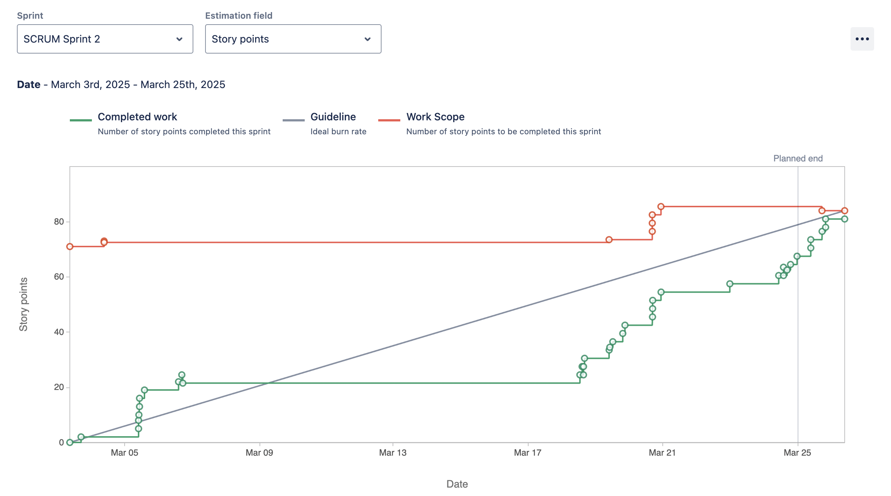

# Phone to Table - CS3398 Project

## Table of Contents
* [Team](#team)
* [Vision](#vision)
* [Features](#features)
* [Technologies](#technologies)
* [Features](#features)
* [Contributions](#constributions)
* [Reports](#reports)

## Team
- Who are our teammates?
    - Cameron Archuleta
    - Tushig Battulga
    - Denise Boler
    - Amanda Orozco
    - Stephen Smyth
    - Elliot Sonoqui

## Vision
### What are we creating?
    A web application that helps users generate recipes based on available ingredients, online content, and personal preferences. We want to bring convenience and fun to the kitchen.
### Who are we creating this for? 
    The target audience are people looking for recipes that is built around their interests, current stock of ingredients, and nutritional profile. Our audience will find value in this app as it will create an ease of use interface that will create a convenient recipe that hits all of their goals.
### Why are we doing this project?
    This web page will help users reduce food waste by making the most of the ingredients they already have. It will also save them money by suggesting recipes that eliminate the need for unnecessary grocery trips. Additionally, it will simplify meal planning by providing tailored recipe recommendations based on their scanned pantry items.

## Technologies
### Front-End:
    - REACT 
    - HTML 
    - CSS 
    - JavaScript
### Back-End:
    - MongoDB
    - JavaScript
    - APIs: Instagram, Spoonacular, OpenAI

## How to Run:
- see CONTRIBUTING.md

## Features
**Feature 1: User input to recipe generatoin**
- Description: user inputs their pantry items and we provide recipes using their items
- User Stories:
    - As a homecook, I want to be able to provide a list of my pantry items so that I can have personalized recipes with what I currently have at home

**Feature 2: URL input to recipe macro generation**
- Description: user provides a URl and we provide the recipes' macros  
 - User Stories:
    - As an health-consciencous user, I want to be able to know the macros of recipes to make macro tracking easier

## Contributitions
### Sprint 1

- **Cameron Archuleta** "I researched the different tools that we will be using for this project. Created a wireframe using figma to give an idea of what our website will look like and created a navbar that links our home & pantry page."
    - [SCRUM-90](https://cs3398-luna-spring.atlassian.net/browse/SCRUM-90) Research: React & HTML | [Bitbucket](https://bitbucket.org/cs3398-luna-s25/recipe_generator/branch/SCRUM-90-research-react-html)

    - [SCRUM-91](https://cs3398-luna-spring.atlassian.net/browse/SCRUM-91) Create a Mock Design of Starter Page | [Bitbucket](https://bitbucket.org/cs3398-luna-s25/recipe_generator/branch/SCRUM-91-create-a-mock-design-of-starter)

    - [SCRUM-72](https://cs3398-luna-spring.atlassian.net/browse/SCRUM-72) Create Navigation Bar | [Bitbucket](https://bitbucket.org/cs3398-luna-s25/recipe_generator/commits/a0e193d713be17baa3a67890ac6f411aacda1c0d)

    - [SCRUM-73](https://cs3398-luna-spring.atlassian.net/browse/SCRUM-73) Implement Icon & Pantry Button | [Bitbucket](https://bitbucket.org/cs3398-luna-s25/recipe_generator/commits/a0e193d713be17baa3a67890ac6f411aacda1c0d)

- **Tushig Battulga**: "Led a meeting to finalize the UI and delegate tasks, set up the development environment, researched React state management, UI frameworks, and routing, and built a backend demo integrating OpenAI’s API for recipe generation."  

    - [SCRUM-92](https://cs3398-luna-spring.atlassian.net/browse/SCRUM-92) Agree upon starter page and delegate work to team members | [Bitbucket](https://bitbucket.org/cs3398-luna-s25/{45b01286-1397-4155-a753-0c05200a2659}/branch/SCRUM-92-agree-upon-starter-page-and-delegate-work-to-team-members) 

    - [SCRUM-87](https://cs3398-luna-spring.atlassian.net/browse/SCRUM-87) React Project Tools for Setup | [Bitbucket](https://bitbucket.org/cs3398-luna-s25/{45b01286-1397-4155-a753-0c05200a2659}/branch/SCRUM-87-research-react-project-tools-for-setup) 

    - [SCRUM-84](https://cs3398-luna-spring.atlassian.net/browse/SCRUM-84) Research React State Management | [Bitbucket](https://bitbucket.org/cs3398-luna-s25/{45b01286-1397-4155-a753-0c05200a2659}/branch/SCRUM-84-research-react-state-management)  
    
    - [SCRUM-88](https://cs3398-luna-spring.atlassian.net/browse/SCRUM-88) Research UI Frameworks and Components | [Bitbucket](https://bitbucket.org/cs3398-luna-s25/{45b01286-1397-4155-a753-0c05200a2659}/branch/SCRUM-88-research-ui-frameworks-and-components)  
 
    - [SCRUM-89](https://cs3398-luna-spring.atlassian.net/browse/SCRUM-89) Research Routing for Navigation Between Pages | [Bitbucket](https://bitbucket.org/cs3398-luna-s25/{45b01286-1397-4155-a753-0c05200a2659}/branch/SCRUM-89-research-routing-for-navigation) 
 
    - [SCRUM-86](https://cs3398-luna-spring.atlassian.net/browse/SCRUM-86) OpenAI API Integration with Sample JSON Ingredients File | [Bitbucket](https://bitbucket.org/cs3398-luna-s25/{45b01286-1397-4155-a753-0c05200a2659}/branch/SCRUM-86-open-ai-api-integration-with-sample-json-ingredients-file)  

- **Denise Boler** "I researched and implemented REACT hooks, created the frontend code layout, used routes to connect UI pages, and created the pantry page with inventory add and remove functionality."
    - [SCRUM-79](https://cs3398-luna-spring.atlassian.net/jira/software/projects/SCRUM/issues/SCRUM-79?jql=project%20%3D%20%22SCRUM%22%20ORDER%20BY%20cf%5B10020%5D%20ASC%2C%20created%20DESC) Research REACT Hooks | [Bitbucket](https://bitbucket.org/cs3398-luna-s25/recipe_generator/branch/SCRUM-79-research-react-hooks)

    - [SCRUM-80](https://cs3398-luna-spring.atlassian.net/jira/software/projects/SCRUM/issues/SCRUM-80?jql=project%20%3D%20%22SCRUM%22%20ORDER%20BY%20cf%5B10020%5D%20ASC%2C%20created%20DESC) Create wirefram mockup using Figma | [Bitbucket](https://bitbucket.org/cs3398-luna-s25/recipe_generator/branch/SCRUM-80-wireframe-mockup)

    - [SCRUM-81](https://cs3398-luna-spring.atlassian.net/jira/software/projects/SCRUM/issues/SCRUM-81?jql=project%20%3D%20%22SCRUM%22%20ORDER%20BY%20cf%5B10020%5D%20ASC%2C%20created%20DESC) UI file & general code setup | [Bitbucket](https://bitbucket.org/cs3398-luna-s25/recipe_generator/branch/SCRUM-81-ui-file-architecture-setup-code)

    - [SCRUM-82](https://cs3398-luna-spring.atlassian.net/jira/software/projects/SCRUM/issues/SCRUM-82?jql=project%20%3D%20%22SCRUM%22%20ORDER%20BY%20cf%5B10020%5D%20ASC%2C%20created%20DESC) Create Pantry page | [Bitbucket](https://bitbucket.org/cs3398-luna-s25/recipe_generator/branches/?status=all&search=scrum-82)

- **Amanda Orozco**: "Provided research materials, documentation, and tutorial resources for both frontend and backend development, with a focus on integrating MongoDB, optimizing backend features, and enhancing SupaBase and Flask functionality."
   
    - [SCRUM-64](https://cs3398-luna-spring.atlassian.net/browse/SCRUM-64) Backend Features and Design | [Bitbucket](https://bitbucket.org/cs3398-luna-s25/%7B45b01286-1397-4155-a753-0c05200a2659%7D/branch/SCRUM-64-backend-features-and-design)

    - [SCRUM-63](https://cs3398-luna-spring.atlassian.net/browse/SCRUM-63) SupaBase/Flask Features | [Bitbucket](https://bitbucket.org/cs3398-luna-s25/%7B45b01286-1397-4155-a753-0c05200a2659%7D/branch/SCRUM-63-research-supabase-flask-designs)

    - [SCRUM-50](https://cs3398-luna-spring.atlassian.net/browse/SCRUM-50) Research React | [Bitbucket](https://bitbucket.org/cs3398-luna-s25/%7B45b01286-1397-4155-a753-0c05200a2659%7D/branch/SCRUM-50-research-react)

    - [SCRUM-94](https://cs3398-luna-spring.atlassian.net/browse/SCRUM-94) Backend Database Startup | [Bitbucket](https://bitbucket.org/cs3398-luna-s25/%7B45b01286-1397-4155-a753-0c05200a2659%7D/branch/SCRUM-94-backend-database-startup)

- **Stephen Smyth** "For Sprint 1, I researched how we could organize the code, helped set up dev environments, and coded."

    - [SCRUM-65](https://cs3398-luna-spring.atlassian.net/browse/SCRUM-65) Research How to Organize a Large Project | [Bitbucket](https://bitbucket.org/cs3398-luna-s25/%7B45b01286-1397-4155-a753-0c05200a2659%7D/branch/SCRUM-65-research-how-to-organize-a-larg) 

    - [SCRUM-66](https://cs3398-luna-spring.atlassian.net/browse/SCRUM-66) Make Scaffolding for Frontend and Backend | [Bitbucket](https://bitbucket.org/cs3398-luna-s25/%7B45b01286-1397-4155-a753-0c05200a2659%7D/branch/SCRUM-66-make-scaffolding-for-frontend-a) 

    - [SCRUM-95](https://cs3398-luna-spring.atlassian.net/browse/SCRUM-95) Make Basic Backend Server | [Bitbucket](https://bitbucket.org/cs3398-luna-s25/%7B45b01286-1397-4155-a753-0c05200a2659%7D/branch/SCRUM-95-make-basic-backend-server) 

- **Elliot Sonoqui** "I did research about the different components we are using, created UI mockups for our application, and created the homepage using react router and useNavigate to jump from page to page."
    -  [SCRUM-53](https://cs3398-luna-spring.atlassian.net/browse/SCRUM-53) Research REACT/Supabase/Flask/OpenAI | [Bitbucket](https://bitbucket.org/cs3398-luna-s25/%7B45b01286-1397-4155-a753-0c05200a2659%7D/branch/feature/SCRUM-53-research-react-supabase/flask/o)

    - [SCRUM-54](https://cs3398-luna-spring.atlassian.net/browse/SCRUM-54) Download Apps/Logins | [Bitbucket](https://bitbucket.org/cs3398-luna-s25/recipe_generator/branch/SCRUM-54-download-apps-logins)

    - [SCRUM-93](https://cs3398-luna-spring.atlassian.net/browse/SCRUM-93) Upload zoom video and transcript explaining code | [Bitbucket)](https://bitbucket.org/cs3398-luna-s25/recipe_generator/branch/SCRUM-93-upload-zoom-video-and-transcrip)

    - [SCRUM-58](https://cs3398-luna-spring.atlassian.net/browse/SCRUM-58) Add hex color scheme | [Bitbucket](https://bitbucket.org/cs3398-luna-s25/recipe_generator/branch/SCRUM-58-add-hex-color-scheme)

    - [SCRUM-61](https://cs3398-luna-spring.atlassian.net/browse/SCRUM-61) Work on UI for the app | [Bitbucket](https://bitbucket.org/cs3398-luna-s25/recipe_generator/branch/SCRUM-61-work-on-ui-for-the-app)

    - [SCRUM-59](https://cs3398-luna-spring.atlassian.net/browse/SCRUM-59) Rreate a home page | [Bitbucket](https://bitbucket.org/cs3398-luna-s25/recipe_generator/branch/SCRUM-61-work-on-ui-for-the-app)

Report:

 *Completed graph should be a little higher at the end as Dr. Lehr allowed a team member (Tushig) to submit his backend demo as a part of Sprint 1 but it isn't reflected here in the graph period.*

### Next Steps: 
* **Cameron Archuleta**
    - Continue working on nav bar / linking new pages & features.
    - Continue building home page to help users understand what we provide.
 * **Tushig Battulga**
    - implement a database with MongoDB that stores the ingredients and their quantities in the pantry
    - make the pantry database editable in regards to entries and quantity
    - connect the frontend with the backend
* **Denise Boler**
    - Refactor frontend for vite use
    - Create Submit button that sends Form 
    - Create parent component 
    - Generator page
* **Amanda Orozco**
    - Develop the database with MongoDB and have it interact with the JSON file
    - Writing unit test cases for backend
* **Stephen Smyth**
    - Make structures for routes, controllers, and services in backen
    - Set up CICD pipeline and deployment
* **Elliot Sonoqui**
    - Create a Form for ingredient input
    - Create a recipe search 
    - Create a JSON file

## Contributitions
### Sprint 2

- **Cameron Archuleta** "I updated the navbar allowing users to navigate to newly added pages/features. Implemented a logo to the navbar which allows users to click it and return to the home page. Created a favorites and ingredient replacement page respectively. Used OpenAI to allow users to input particular ingredients and then prompted openAI to suggest replacements."
    
    
    - [SCRUM-72](https://cs3398-luna-spring.atlassian.net/browse/SCRUM-72) Create Navigation Bar | [Bitbucket](https://bitbucket.org/cs3398-luna-s25/%7B45b01286-1397-4155-a753-0c05200a2659%7D/branch/SCRUM-72-create-navigation-bar)

    *This task (SCRUM-72) was carried over from sprint 1 and meant to add pages to navbar but that was done per individual task below*

    - [SCRUM-73](https://cs3398-luna-spring.atlassian.net/browse/SCRUM-73) Implement Icon/Logo | [Bitbucket](https://bitbucket.org/cs3398-luna-s25/%7B45b01286-1397-4155-a753-0c05200a2659%7D/branch/SCRUM-73-implement-icon-logo)
        
    - [SCRUM-125](https://cs3398-luna-spring.atlassian.net/browse/SCRUM-125) Refactor 'ingredient replacement' to use components for backend | [Bitbucket](https://bitbucket.org/cs3398-luna-s25/%7B45b01286-1397-4155-a753-0c05200a2659%7D/branch/SCRUM-125-refactor-ingredient-replacement)
   
    - [SCRUM-128](https://cs3398-luna-spring.atlassian.net/browse/SCRUM-128) Create 'ingredient replacement' page (frame) | [Bitbucket](https://bitbucket.org/cs3398-luna-s25/recipe_generator/branch/SCRUM-128-create-ingredient-replacement-page)

    - [SCRUM-127](https://cs3398-luna-spring.atlassian.net/browse/SCRUM-127) Create 'favorites' page (frame) | [Bitbucket](https://bitbucket.org/cs3398-luna-s25/%7B45b01286-1397-4155-a753-0c05200a2659%7D/branch/featureSCRUM-127-create-favorites-page-frame)

- **Tushig Battulga**
"I researched commmunication between React and Node, implemented the ingredients to recipe (text only) feature, integrated OpenAI API with sample file for demo, added features to allow generation page to pull from text, established communication between the front end and back end, created the UI for the Cookbook page, integrated search by name feature via MealDB API, and displayed those results in the Cookbook page."
  
    - [SCRUM-85](https://cs3398-luna-spring.atlassian.net/browse/SCRUM-85) Ingredients to Recipe Implementation (Text Only) | [Bitbucket](https://bitbucket.org/cs3398-luna-s25/{45b01286-1397-4155-a753-0c05200a2659}/branch/SCRUM-85-ingredients-to-recipe-implementation-text-only)  

    - [SCRUM-119](https://cs3398-luna-spring.atlassian.net/browse/SCRUM-119) Research Communication Between Frontend React and Backend Node | [Bitbucket](https://bitbucket.org/{d93f5839-8dd2-41e8-9a85-42843050e9e1}/{45b01286-1397-4155-a753-0c05200a2659}/pull-requests/17) 
 
    - [SCRUM-86](https://cs3398-luna-spring.atlassian.net/browse/SCRUM-86) OpenAI API Integration with Sample JSON Ingredients File | [Bitbucket](https://bitbucket.org/{d93f5839-8dd2-41e8-9a85-42843050e9e1}/{45b01286-1397-4155-a753-0c05200a2659}/pull-requests/26) 

    - [SCRUM-120](https://cs3398-luna-spring.atlassian.net/browse/SCRUM-120) Generation Page Has Features to Pull from Existing Pantry and Text | [Bitbucket](https://bitbucket.org/{d93f5839-8dd2-41e8-9a85-42843050e9e1}/{45b01286-1397-4155-a753-0c05200a2659}/pull-requests/34)  
 
    - [SCRUM-114](https://cs3398-luna-spring.atlassian.net/browse/SCRUM-114) Establish Communication Between Frontend and Backend | [Bitbucket](https://bitbucket.org/{d93f5839-8dd2-41e8-9a85-42843050e9e1}/{45b01286-1397-4155-a753-0c05200a2659}/pull-requests/35) 

    - [SCRUM-135](https://cs3398-luna-spring.atlassian.net/browse/SCRUM-135) Create UI Page for Cookbook | [Bitbucket](https://bitbucket.org/{d93f5839-8dd2-41e8-9a85-42843050e9e1}/{45b01286-1397-4155-a753-0c05200a2659}/pull-requests/36)  

    - [SCRUM-136](https://cs3398-luna-spring.atlassian.net/browse/SCRUM-136) Integrate Search by Name API for Cookbook | [Bitbucket](https://bitbucket.org/{d93f5839-8dd2-41e8-9a85-42843050e9e1}/{45b01286-1397-4155-a753-0c05200a2659}/pull-requests/37) 

    - [SCRUM-137](https://cs3398-luna-spring.atlassian.net/browse/SCRUM-137) Display Cookbook API Results | [Bitbucket](https://bitbucket.org/{d93f5839-8dd2-41e8-9a85-42843050e9e1}/{45b01286-1397-4155-a753-0c05200a2659}/pull-requests/38)  

- **Denise Boler**: "Refactor fronted to form type for backend requesting. Researched and implemented backend routing to frontend and API. Handled HTTP response and request by using get, post, delete, etc methods and functions. Used OpenAI, mealdb, and spoonacular APIs to fetch recipes and handle user requests" 
    - [SCRUM-115](https://cs3398-luna-spring.atlassian.net/browse/SCRUM-115?atlOrigin=eyJpIjoiMTZlNGE5ODU5Y2RiNGQ5N2E0MjZhY2E4NTk0NmYyYzQiLCJwIjoiaiJ9) Refactor Pantry page to include form |  [Bitbucket](https://bitbucket.org/cs3398-luna-s25/recipe_generator/commits/branch/SCRUM-115-refactor-pantry-form)

    - [SCRUM-122](https://cs3398-luna-spring.atlassian.net/issues/SCRUM-122?filter=-4&jql=assignee%20%3D%20712020%3A5ae69070-1508-48a2-bad1-f7b364a4f009%20ORDER%20BY%20created%20DESC) Add 'View Recipe' feature from Cookbook | [Bitbucket](https://bitbucket.org/cs3398-luna-s25/recipe_generator/commits/branch/SCRUM-122-view-recipe)

    - [SCRUM-123](https://cs3398-luna-spring.atlassian.net/issues/SCRUM-123?filter=-4&jql=assignee%20%3D%20712020%3A5ae69070-1508-48a2-bad1-f7b364a4f009%20ORDER%20BY%20created%20DESC) Add Pantry backend components | [Bitbucket](https://bitbucket.org/cs3398-luna-s25/recipe_generator/commits/branch/SCRUM-123-pantry-backend-components)

    - [SCRUM-126](https://cs3398-luna-spring.atlassian.net/issues/SCRUM-126?filter=-4&jql=assignee%20%3D%20712020%3A5ae69070-1508-48a2-bad1-f7b364a4f009%20ORDER%20BY%20created%20DESC) Add quantity input to pantry items | [Bitbucket](https://bitbucket.org/cs3398-luna-s25/recipe_generator/commits/branch/SCRUM-126-pantry-quantity)

    - [SCRUM-129](https://cs3398-luna-spring.atlassian.net/issues/SCRUM-129?filter=-4&jql=assignee%20%3D%20712020%3A5ae69070-1508-48a2-bad1-f7b364a4f009%20ORDER%20BY%20created%20DESC) Research frontend to backend communication | [Bitbucket](https://bitbucket.org/cs3398-luna-s25/recipe_generator/commits/branch/SCRUM-129-research-front-to-back-communication)

- **Amanda Orozco**: "Provided research for Postman's API testing and automation capabilities and identified a strategy to integrate it in the next sprint to streamline our database connectivity. I designed user-centric database collections that organize pantry items and recipes by user, and implemented comprehensive CRUD operations to enable efficient data management."
    - [SCRUM-105](https://cs3398-luna-spring.atlassian.net/browse/SCRUM-105) Postman Research | [Bitbucket](https://bitbucket.org/cs3398-luna-s25/recipe_generator/branch/SCRUM-105-postman-research)

    - [SCRUM-102](https://cs3398-luna-spring.atlassian.net/browse/SCRUM-102) Initial DB setup | [Bitbucket](https://bitbucket.org/cs3398-luna-s25/recipe_generator/branch/SCRUM-102-db-initial-set-up)

    - [SCRUM-103](https://cs3398-luna-spring.atlassian.net/browse/SCRUM-103) Create a mock database | [Bitbucket](https://bitbucket.org/cs3398-luna-s25/recipe_generator/branch/SCRUM-103-create-a-mock-database)
    
    - [SCRUM-104](https://cs3398-luna-spring.atlassian.net/browse/SCRUM-104) Create CRUD operations | [Bitbucket](https://bitbucket.org/cs3398-luna-s25/recipe_generator/branch/SCRUM-104-create-crud-operations)
    
    - [SCRUM-138](https://cs3398-luna-spring.atlassian.net/browse/SCRUM-138) Organize Collections | [Bitbucket](https://bitbucket.org/cs3398-luna-s25/recipe_generator/branch/SCRUM-138-organize-collections)

- **Stephen Smyth** "For Sprint 2 I made basic infrastructure for the backend for others to build off of, looked into feasibility of user authentication and deployment options given our timeline, and updated documentation on how to run the project."
 
    - [SCRUM-130](https://cs3398-luna-spring.atlassian.net/browse/SCRUM-130?atlOrigin=eyJpIjoiNmJlMWM0MjU5NTUyNGJlMTlkYmMyOWNkYWE1NGJlZTQiLCJwIjoiaiJ9) Create route and connect controller/service | [Bitbucket](https://bitbucket.org/cs3398-luna-s25/recipe_generator/src/SCRUM-130-create-route-and-connect-contr/)  
 
    - [SCRUM-131](https://cs3398-luna-spring.atlassian.net/browse/SCRUM-131?atlOrigin=eyJpIjoiNjI0YmU3YTNlYjhjNGJjYmJiOTVjZjIxNWJlZmY5MDQiLCJwIjoiaiJ9) Create docs for how to run and contribute to the project | [Bitbucket](https://bitbucket.org/cs3398-luna-s25/recipe_generator/src/SCRUM-131-create-docs-for-how-to-run-and/) 
 
    - [SCRUM-133](https://cs3398-luna-spring.atlassian.net/browse/SCRUM-133?atlOrigin=eyJpIjoiNzE3Nzg3M2NhMjg0NGJlZmJjYzc2ZjJmNzFhMzU0YTgiLCJwIjoiaiJ9) Look into deployment options | [Bitbucket](https://bitbucket.org/cs3398-luna-s25/recipe_generator/src/SCRUM-133-look-into-deployment-options/)  

     - [SCRUM-132](https://cs3398-luna-spring.atlassian.net/browse/SCRUM-132?atlOrigin=eyJpIjoiM2U0NmUxYTk3ZTZjNDY5OWI3OWQwZjRlOTJjYjYxOWEiLCJwIjoiaiJ9) Research user authentication feasibility for project | [Bitbucket](https://bitbucket.org/cs3398-luna-s25/recipe_generator/src/SCRUM-132-research-user-authentication-f/) 

- **Elliot Sonoqui** "I refactored the frontend to use vite and tailwind css. I replaced useState with react router which is more scalable. I implemented generation page functionality, and simplified pantry page functionality."
    - [SCRUM-109](https://cs3398-luna-spring.atlassian.net/browse/SCRUM-109) Refactor frontend to use Vite | [Bitbucket](https://bitbucket.org/cs3398-luna-s25/recipe_generator/src/SCRUM-109-refactor-frontend-to-use-vite/)

    - [SCRUM-110](https://cs3398-luna-spring.atlassian.net/browse/SCRUM-110) Refactor frontend to use Tailwind | [Bitbucket](https://bitbucket.org/cs3398-luna-s25/recipe_generator/commits/?search=SCRUM-110)

    - [SCRUM-112](https://cs3398-luna-spring.atlassian.net/browse/SCRUM-112) Create Generation page frame | [Bitbucket](https://bitbucket.org/cs3398-luna-s25/recipe_generator/commits/?search=SCRUM-112)

    -  [SCRUM-124](https://cs3398-luna-spring.atlassian.net/browse/SCRUM-124) Update TailwindCSS to Pages| [Bitbucket](https://bitbucket.org/cs3398-luna-s25/recipe_generator/commits/?search=SCRUM-124)
    
    - [SCRUM-134](https://cs3398-luna-spring.atlassian.net/browse/SCRUM-134) Remove Pantry Generation button/logic | [Bitbucket](https://bitbucket.org/cs3398-luna-s25/recipe_generator/commits/?search=SCRUM-134)
  

Report:

### Next Steps: 
* **Cameron Archuleta**
    - Add a favorites option to the generated recipes, which send and save them to favorites page.
    - Implement constraints on the ingredient replacement generator to only allow valid food items.
    - Update the layout of specifc pages to allow for a more friendly user experience.
* **Tushig Battulga**
    - Set up profile page in which the user can add their expertise level, dietary restrictions, and favorited meals.
    - Set up a random meal or recommended meal section on home page.
    - Small general UI improvements
    - AI picture generation for generated meals
    - Format ChatGPT's responses to be cleaner and neater
    - Receipt scan feature and integrate it into Pantry page
    - Further customization for generated recepies - like type of meal (can be dropdown), duration
    - Reverse search food to recipe feature
    - Welcome page - can enter information about profile here
* **Denise Boler**
    - Implement spoonacular to 'search by ingredients' feature
    - Implement front and backend recipe steps and progress bar
    - Refine backend routing
    - Utilitze cool tailwind UI components
* **Amanda Orozco**
    - Integrate Postman Tests into the CI/CD Pipeline
    - Transition from Mock to Production Database
    - Refinement and Optimization of CRUD Operations
* **Stephen Smyth**
    - clean up the codebase (delete old frontend, update readme)
    - deploy the app on railway in a docker container
    - help set up the database and connect it to the backend
* **Elliot Sonoqui**
    - Clean up the navigation bar and add a drop down for different pages
    - Update the recipes on the homepage to pull from an API
    - Work on a profile page for a user
